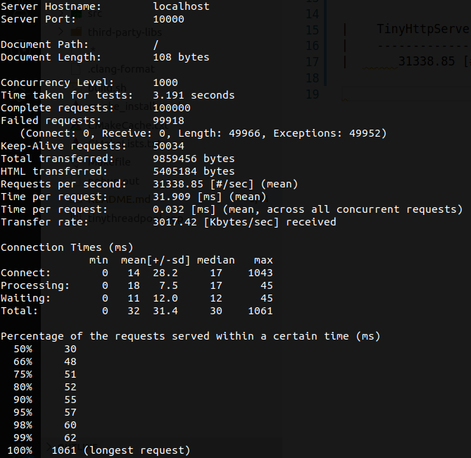
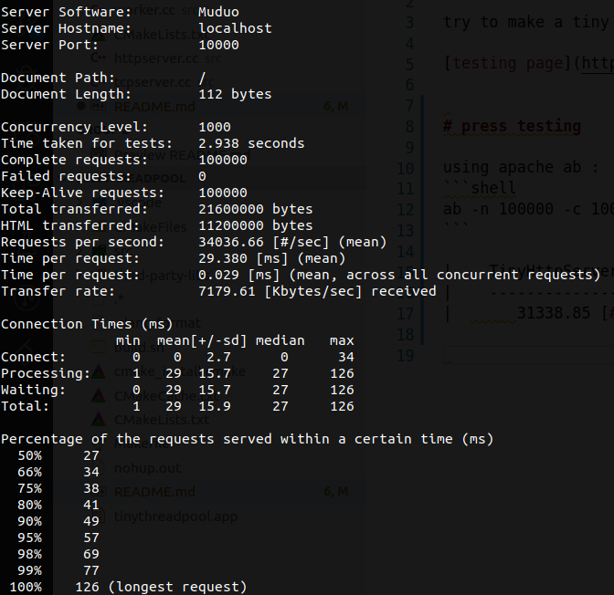

# tiny http server

try to make a tiny http server based on lockfree threadpool

[testing page](http://www.howard97.top)


# bench 

using apache ab :
```shell
ab -n 100000 -c 1000 -k -r http://localhost:10000/
```

|    TinyHttpServer     | Muduo |
|    ----------------   |-------|
|  	31338.85 [#/sec]|  34036.66 [#/sec]	
|  | |


